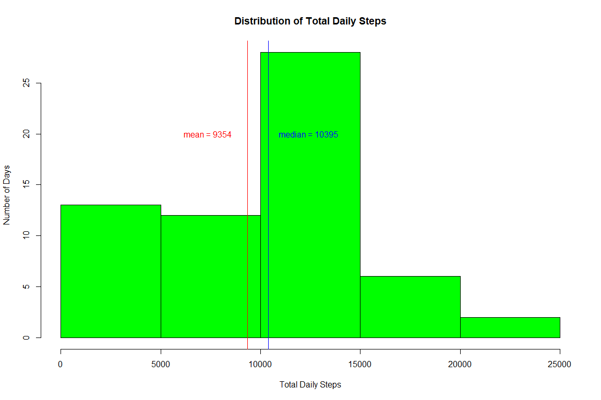
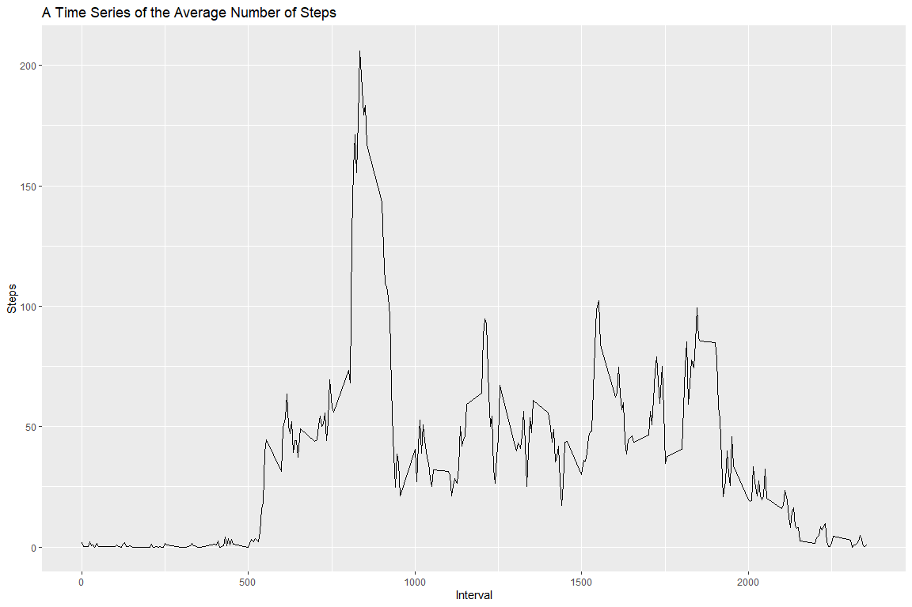
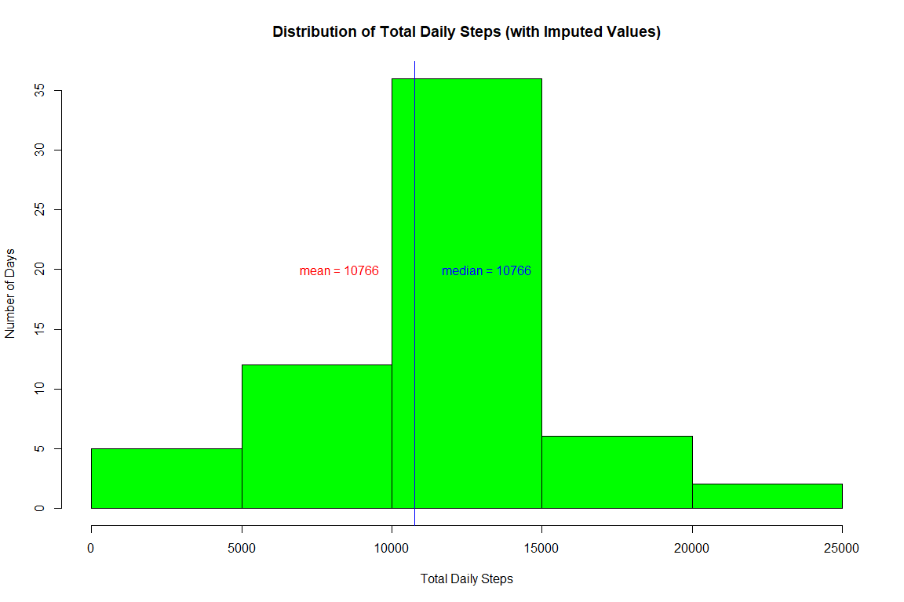
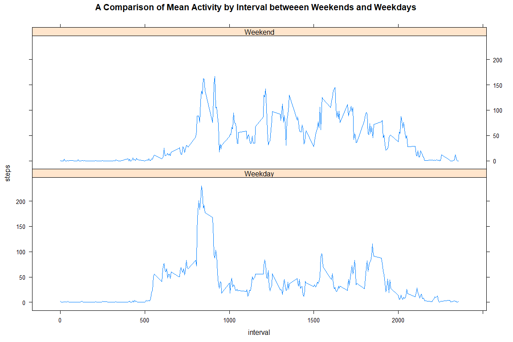

## Install Libraries and Set Global Options for Chunks

```r
knitr::opts_chunk$set(fig.width=12, fig.height=8, fig.path='Figs/',
                      echo=TRUE, warning=FALSE, message=FALSE)
```


```r
library(dplyr)
library(ggplot2)
library(lattice)
```
## Loading and preprocessing the data
Download and read files

```r
activity <-
  read.csv(unz("activity.zip", "activity.csv"),
           colClasses = c("double", "character", "double"))
activity$date <- as.Date(activity$date, "%Y-%m-%d")
activity <- tbl_df(activity)
```

## What is mean total number of steps taken per day?
Summarize the activity table by total steps per day.

```r
day0 <- group_by(activity, date) %>%
        summarize(steps = sum(steps, na.rm = TRUE))
```
Calculate mean and median for use in the summary statement.

```r
mean0 <- round(mean(day0$steps),0)
median0 <- round(median(day0$steps),0)
```
Plot histogram with a vertical line showing the median and mean.

```r
hist(
        day0$steps,
        breaks = 5,
        col = "green",
        main = "Distribution of Total Daily Steps",
        xlab = "Total Daily Steps",
        ylab = "Number of Days"
)
abline(v=mean0, col="red")
text(mean0-2000,20,paste("mean =", mean0),col="red")
abline(v=median0, col="blue")
text(median0+2000,20,paste("median =", median0),col="blue")
```

<!-- -->

The mean and median number of steps per day are **9354** and **10395** respectively.

## What is the average daily activity pattern?
Summarize the Interval data by mean.

```r
time <- group_by(activity,interval)
times <- summarize(time,steps=mean(steps,na.rm=TRUE))
##Variables to be used in the text below. 
maxsteps <- round(max(times$steps),0)
maxinterval <- round(as.numeric(times[which.max(times$steps),1]),0)
```
The most active interval is **835** with an average of **206** steps.

Now to plot the time series.

```r
g1 <- ggplot(times, aes(x=interval, y=steps)) +
        geom_line() +
        xlab("Interval") +
        ylab("Steps") +
        ggtitle("A Time Series of the Average Number of Steps")
g1
```

<!-- -->


## Imputing missing values
There are 2304 missing values.

Define a new instance of the **activty** table called **imputed**.
Replace missing values in **imputed** with mean from the **times** table.

```r
imputed <- read.csv(unz("activity.zip", "activity.csv"),
                    colClasses = c("double", "character", "double"))
imputed$date <- as.Date(imputed$date, "%Y-%m-%d")
for (i in 1:nrow(imputed)) {
        if (is.na(imputed[i, 1]) == TRUE)
        {
                imputed[i, 1] <- times[match(imputed[i, 3], times$interval), 2]
        }
}
```
Check that there are now no missing values.

```r
summary(imputed)
```

```
##      steps             date               interval     
##  Min.   :  0.00   Min.   :2012-10-01   Min.   :   0.0  
##  1st Qu.:  0.00   1st Qu.:2012-10-16   1st Qu.: 588.8  
##  Median :  0.00   Median :2012-10-31   Median :1177.5  
##  Mean   : 37.38   Mean   :2012-10-31   Mean   :1177.5  
##  3rd Qu.: 27.00   3rd Qu.:2012-11-15   3rd Qu.:1766.2  
##  Max.   :806.00   Max.   :2012-11-30   Max.   :2355.0
```

Summarize imputed dataset.

```r
day1 <- group_by(imputed,date) %>%
summarize(steps = sum(steps, na.rm = TRUE))

mean1 <- round(mean(day1$steps),0)
median1 <- round(median(day1$steps),0)
```
Generate new plot and original plot.

```r
hist(
        day1$steps,
        breaks = 5,
        col = "green",
        main = "Distribution of Total Daily Steps (with Imputed Values)",
        xlab = "Total Daily Steps",
        ylab = "Number of Days"
)
abline(v=mean1, col="red")
text(mean1-2500,20,paste("mean =", mean1),col="red")
abline(v=median1, col="blue")
text(median1+2400,20,paste("median =", median1),col="blue")
```

<!-- -->
The mean and median number of steps per day are **10766** and **10766** respectively.

The effect of imputing missing values was to raise the mean by **1412** and the median by **371**. The mean and median are now equal due to the method by which missing values were imputed.

## Are there differences in activity patterns between weekdays and weekends?

Firstly, convert date to weekday name. Then use a for loop to assign the days  a label (Weekday or Weekend).

```r
imputed <- mutate(imputed,weekday = weekdays(date))

for (i in 1:nrow(imputed)) {
        if (imputed$weekday[i] == "Sunday" |
            imputed$weekday[i] == "Saturday") {
                imputed$weekday[i] <- "Weekend"
        } else {
                imputed$weekday[i] <- "Weekday"
        }
}
```

Convert weekday to a factor and then summarise steps by interval.

```r
imputed <- transform(imputed, weekday = factor(weekday))
imputedtime <- group_by(imputed, interval, weekday) %>%
        summarize(steps = mean(steps, na.rm = FALSE))
```

Plot the panel as columns to directly compare time intervals.

```r
xyplot(
        steps ~ interval |
                weekday,
        imputedtime,
        type = "l",
        layout = c(1, 2),
        main = "A Comparison of Mean Activity by Interval betweeen Weekends and Weekdays"
)
```

<!-- -->
